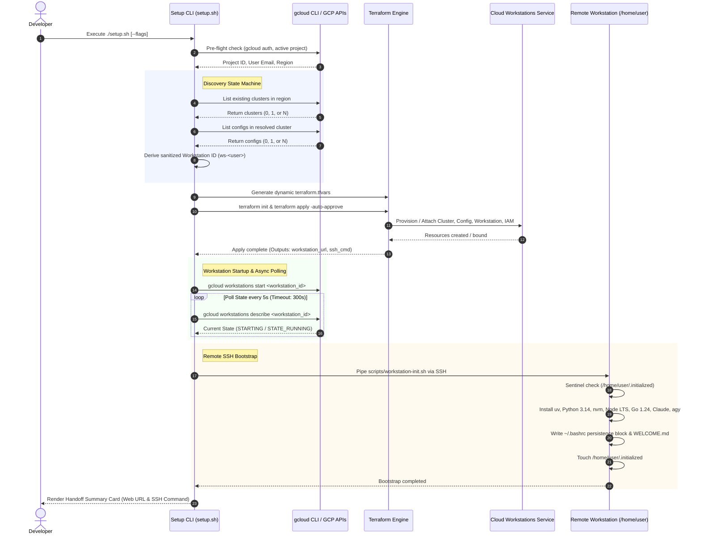

# GCP Cloud Workstations Automated Developer Bootstrap

[](https://cloud.google.com/workstations)
[](https://www.terraform.io/)
[](https://docs.astral.sh/uv/)
[](https://nodejs.org/)
[](https://go.dev/)
[](https://docs.anthropic.com/en/docs/agents-and-tools/claude-code/overview)
[](https://cloud.google.com/)

An enterprise-grade, fully automated infrastructure-as-code and bootstrap orchestrator for [Google Cloud Workstations](https://cloud.google.com/workstations). This repository enables developers and platform engineering teams to provision, configure, and bootstrap production-ready cloud developer environments with pre-integrated AI coding companions ([Claude Code](https://docs.anthropic.com/en/docs/agents-and-tools/claude-code/overview) and [Google Antigravity](https://cloud.google.com/)), modern language runtimes (Python 3.14 via `uv`, Node.js LTS via `nvm`, and Go 1.24+ SDK), and strictly isolated persistent user-space storage.

---

## Table of Contents

- [System Overview & Architecture](#system-overview--architecture)
  - [Architecture Sequence Flow](#architecture-sequence-flow)
  - [ASCII Lifecycle Workflow](#ascii-lifecycle-workflow)
- [Touchpoint Manifest](#touchpoint-manifest)
- [Prerequisites & Requirements](#prerequisites--requirements)
- [Setup CLI Orchestrator Guide](#setup-cli-orchestrator-guide)
  - [Command-Line Options & Flags](#command-line-options--flags)
  - [Environment Variables](#environment-variables)
  - [Interactive Discovery State Machine](#interactive-discovery-state-machine)
  - [Non-Interactive & CI/CD Automation](#non-interactive--cicd-automation)
  - [Dry-Run Simulation Mode](#dry-run-simulation-mode)
- [Terraform Reference](#terraform-reference)
  - [Variables Reference](#variables-reference)
  - [Outputs Reference](#outputs-reference)
  - [Deployment Topologies](#deployment-topologies)
    - [Greenfield Deployment (New Cluster & Config)](#greenfield-deployment-new-cluster--config)
    - [Brownfield Deployment (Attach to Existing Cluster & Config)](#brownfield-deployment-attach-to-existing-cluster--config)
    - [Private Endpoint & Strict Network Isolation](#private-endpoint--strict-network-isolation)
- [Runtime Environment & User-Space Isolation](#runtime-environment--user-space-isolation)
  - [Persistent vs. Ephemeral Storage Architecture](#persistent-vs-ephemeral-storage-architecture)
  - [Pre-Installed Toolchain Matrix](#pre-installed-toolchain-matrix)
  - [Idempotent Shell Configuration & MOTD](#idempotent-shell-configuration--motd)
  - [Authentication Guide](#authentication-guide)
    - [1. Google Antigravity CLI (agy)](#1-google-antigravity-cli-agy)
    - [2. Claude Code CLI (Vertex AI vs. API Key)](#2-claude-code-cli-vertex-ai-vs-api-key)
    - [3. Google Cloud Application Default Credentials (ADC)](#3-google-cloud-application-default-credentials-adc)
- [Cost Optimization, Sizing & Timeouts](#cost-optimization-sizing--timeouts)
- [Testing & Quality Assurance](#testing--quality-assurance)
  - [Static Analysis & Code Quality](#static-analysis--code-quality)
  - [Automated Integration Test Suite](#automated-integration-test-suite)
  - [Post-Deployment Validation](#post-deployment-validation)
- [Day-2 Operations & Teardown](#day-2-operations--teardown)
  - [Starting and Stopping Instances](#starting-and-stopping-instances)
  - [Port Forwarding to Localhost](#port-forwarding-to-localhost)
  - [Clean Teardown (terraform destroy)](#clean-teardown-terraform-destroy)
- [Troubleshooting & Operational Recovery Runbook](#troubleshooting--operational-recovery-runbook)
  - [1. Recovering from Interrupted or Failed Bootstraps](#1-recovering-from-interrupted-or-failed-bootstraps)
  - [2. Diagnosing Asynchronous Polling Timeouts & Cluster Failures](#2-diagnosing-asynchronous-polling-timeouts--cluster-failures)
  - [3. Private Endpoint (PSC) Routing & Cloud DNS Configuration](#3-private-endpoint-psc-routing--cloud-dns-configuration)
- [License](#license)

---

## System Overview & Architecture

Google Cloud Workstations provides managed, containerized developer workspaces running on Google Compute Engine virtual machine hosts. However, out-of-the-box base images discard container filesystem modifications on workstation stop/start cycles.

This solution solves this operational hurdle by orchestrating a **two-tier deployment**:
1. **Infrastructure Plane (Terraform)**: Declaratively provisions or discovers workstation clusters, workstation configurations (`n2-standard-8`, 200GB `pd-balanced` home volume, quick-start pool 1, idle timeout 2h), workstation instances, and granular IAM bindings (`roles/workstations.user`). Modern machine series (such as N4, C3, C4, A3) requiring Hyperdisk Balanced High Availability are dynamically supported.
2. **User-Space Runtime Plane (`workstation-init.sh`)**: Once the instance reaches `STATE_RUNNING`, the orchestrator tunnels over `gcloud workstations ssh` to provision modern developer runtimes directly into `/home/user` (`~/.local/bin`, `~/.nvm`, `~/sdk/go`, `~/go`). This guarantees **100% persistent toolchains** across VM restarts without requiring `sudo` privileges or custom golden container image pipelines.

### Architecture Sequence Flow



### ASCII Lifecycle Workflow

```text
+---------------------------------------------------------------------------------------+
|                                SETUP CLI ORCHESTRATOR                                 |
|                                     (./setup.sh)                                      |
+---------------------------------------------------------------------------------------+
                                           |
                                           v
+---------------------------------------------------------------------------------------+
|  PRE-FLIGHT VALIDATION                                                                |
|  - Verify gcloud CLI >= 450.0.0 & terraform >= 1.5.0                                  |
|  - Resolve GCP Project ID & Active Authenticated Account (developer@example.com)      |
+---------------------------------------------------------------------------------------+
                                           |
                                           v
+---------------------------------------------------------------------------------------+
|  DISCOVERY STATE MACHINE                                                              |
|  - Cluster Discovery:  Select existing cluster OR flag create_cluster = true          |
|  - Config Discovery:   Select existing config  OR flag create_config  = true          |
|  - Name Derivation:    Sanitize user email -> workstation ID (e.g. ws-john-doe)       |
+---------------------------------------------------------------------------------------+
                                           |
                                           v
+---------------------------------------------------------------------------------------+
|  INFRASTRUCTURE PROVISIONING (Terraform)                                              |
|  - Dynamic terraform.tfvars synthesized & backed up                                   |
|  - terraform init && terraform apply -auto-approve                                    |
|  - Cloud Workstations Cluster + Config (n2-standard-8, 200GB pd-balanced) + IAM Role  |
+---------------------------------------------------------------------------------------+
                                           |
                                           v
+---------------------------------------------------------------------------------------+
|  ASYNC STATE POLLING                                                                  |
|  - Trigger: gcloud workstations start <workstation-id>                                |
|  - Poll loop: gcloud workstations describe (interval: 5s, timeout: 300s)              |
|  - Await: STATE_RUNNING                                                               |
+---------------------------------------------------------------------------------------+
                                           |
                                           v
+---------------------------------------------------------------------------------------+
|  REMOTE TOOLCHAIN BOOTSTRAP (via gcloud workstations ssh)                             |
|  - Check sentinel: /home/user/.initialized (skip if already run)                      |
|  - Install Astral uv -> Python 3.14 -> symlink ~/.local/bin/python3.14                |
|  - Install nvm -> Node.js LTS (v22) -> npm install -g @anthropic-ai/claude-code      |
|  - Install Go 1.24 SDK (linux-amd64) -> GOROOT=~/sdk/go -> symlink ~/.local/bin/go   |
|  - Install Google Antigravity CLI (agy)                                               |
|  - Write persistent ~/.bashrc block (GOROOT, GOPATH, NVM_DIR, PATH, aliases)          |
|  - Render & deploy /home/user/WELCOME.md onboarding guide                            |
|  - Touch sentinel: /home/user/.initialized                                            |
+---------------------------------------------------------------------------------------+
                                           |
                                           v
+---------------------------------------------------------------------------------------+
|  HANDOFF SUMMARY CARD                                                                 |
|  - Web IDE URL: https://<workstation>.<cluster>.<region>.workstations.cloud.google    |
|  - SSH Command: gcloud workstations ssh <workstation-id> --region=<region> ...        |
|  - MOTD & Next Steps: agy auth login, claude, motd                                    |
+---------------------------------------------------------------------------------------+
```

---

## Touchpoint Manifest

The repository is structured following modular infrastructure-as-code principles:

| File / Path | Component Type | Lifecycle Role & Description |
| :--- | :--- | :--- |
| `setup.sh` | Orchestrator CLI | Unified POSIX/Bash orchestrator. Executes pre-flight validation, discovery state machine, dynamic HCL variable synthesis, Terraform execution, async state polling, and remote SSH toolchain deployment. |
| `main.tf` | Terraform Core | Core GCP Cloud Workstations resource declarations (`google_workstations_workstation_cluster`, `google_workstations_workstation_config`, `google_workstations_workstation`, and `google_workstations_workstation_iam_member`). |
| `variables.tf` | Terraform Inputs | Input variable definitions with strict validation regex rules, type constraints, and enterprise defaults. |
| `outputs.tf` | Terraform Outputs | Output values for instance IDs, resource names, cluster hostnames, Web IDE access URLs, and pre-formatted SSH/start commands. |
| `versions.tf` | Version Constraints | Declares minimum Terraform core version (`>= 1.5.0`) and Google Cloud provider constraints (`hashicorp/google >= 5.0.0`). |
| `providers.tf` | Provider Config | Configures the `google` provider with `var.project_id` and `var.region`. |
| `terraform.tfvars.example` | Configuration Example | Reference variable definition file for manual or customized Terraform deployments. |
| `.env.example` | Environment Example | Reference environment file documenting all orchestrator variables (`PROJECT_ID`, `REGION`, `CLUSTER_ID`, `CONFIG_ID`, `WORKSTATION_ID`, `USER_EMAIL`, `NON_INTERACTIVE`, `DRY_RUN`). |
| `scripts/workstation-init.sh` | Container Provisioner | Remote user-space bootstrap script executed inside the workstation container via SSH. Installs `uv`, Python 3.14, `nvm`, Node.js LTS, Claude Code, `agy`, Go 1.24, and wires `~/.bashrc`. |
| `templates/WELCOME.md.tmpl` | Onboarding Template | Markdown template interpolated during bootstrap with dynamic workstation IDs, clusters, regions, and runtime versions; placed at `/home/user/WELCOME.md`. |
| `tests/test_setup.sh` | Automated Test Suite | Comprehensive unit/regression test harness validating CLI argument parsing, input validation, discovery menus, mock dry-runs, and macOS Bash/Zsh compatibility. |
| `QUICKSTART.md` | Developer Onboarding | 3-minute rapid onboarding guide optimized for Google Cloud Shell and local terminals. |
| `README.md` | Repository Docs | Enterprise architectural specification, operational runbook, and technical reference. |

---

## Prerequisites & Requirements

Before running the orchestrator, ensure the following prerequisites are met:

### 1. Local Tooling
- **`gcloud` CLI** (`>= 450.0.0`): Authenticated to Google Cloud (`gcloud auth login` and `gcloud auth application-default login`).
- **`terraform` CLI** (`>= 1.5.0`): Installed and accessible in your shell `$PATH`.
- **Operating System**: macOS (tested on native `/bin/bash` 3.2+ and `zsh`) or Linux (Ubuntu, Debian, Red Hat, Google Cloud Shell).

### 2. Google Cloud Permissions & IAM Roles
Your authenticated GCP user or service account must possess the following IAM roles on the target project:
- **Cloud Workstations Admin** (`roles/workstations.admin`) – Required to manage clusters, configs, and workstations.
- **Compute Network Viewer / Admin** (`roles/compute.networkUser` or `roles/compute.networkAdmin`) – Required to attach workstations to VPC networks and subnets.
- **Service Usage Admin** (`roles/serviceusage.serviceUsageAdmin`) – Required if APIs need activation.

### 3. Required GCP APIs
The following APIs must be enabled on your GCP project:
```bash
gcloud services enable \
  workstations.googleapis.com \
  compute.googleapis.com \
  iam.googleapis.com
```

---

## Setup CLI Orchestrator Guide

The `setup.sh` script is the primary entrypoint. It can be run **interactively** (prompting the user through discovery menus) or **non-interactively** (for scripted CI/CD deployments).

### Command-Line Options & Flags

```text
Usage: ./setup.sh [OPTIONS]

Automated setup, provisioning, and bootstrap orchestrator for GCP Cloud Workstations.

Options:
  -r, --region <region>         GCP region (default: us-central1)
  -d, --dry-run                 Simulate API calls and actions without modifying infrastructure
  -n, -y, --non-interactive     Non-interactive mode (use defaults / flags / env vars)
  -p, --project <project_id>    GCP Project ID override
  -e, --email <user_email>      Workstation user email override
  -c, --cluster <cluster_id>    Target workstation cluster ID
      --config <config_id>      Target workstation config ID
  -w, --workstation <id>        Target workstation ID
  -h, --help                    Show this help message and exit
```

### Environment Variables

The orchestrator respects the following environment variables if CLI flags are omitted:

| Variable | Description | Default Value |
| :--- | :--- | :--- |
| `PROJECT_ID` or `GCP_PROJECT_ID` | Target Google Cloud Project ID | Active project from `gcloud config get-value project` |
| `REGION` or `GCP_REGION` | Target GCP region | `us-central1` |
| `USER_EMAIL` | Workstation user identity for IAM binding | Active account from `gcloud auth list` |
| `NON_INTERACTIVE` | Set to `1` or `true` for headless non-interactive mode | `false` |
| `DRY_RUN` | Set to `1` or `true` to simulate operations | `false` |
| `NO_COLOR` | Set to disable ANSI terminal colors | Unset |

---

### Interactive Discovery State Machine

When launched without `--non-interactive`, `setup.sh` executes an intelligent discovery state machine:

1. **Pre-flight Tool Check**: Verifies that `gcloud` and `terraform` binaries exist in `$PATH`.
2. **Project & Identity Resolution**: Auto-detects active project and authenticated account, offering confirmation prompts.
3. **Cluster Discovery**:
   - Lists existing workstation clusters in the selected region via `gcloud workstations clusters list`.
   - **0 Clusters Found**: Prompts to create a new cluster (`ws-cluster`).
   - **1 Cluster Found**: Prompts whether to attach to the existing cluster or create a new one.
   - **Multiple Clusters Found**: Renders a numbered selection menu with an additional option to create a new cluster.
4. **Configuration Discovery**:
   - If attaching to an existing cluster, queries configurations via `gcloud workstations configs list`.
   - Renders a selection menu or prompts to create a new configuration with `n2-standard-8` specifications.
5. **Workstation Naming & IAM Derivation**:
   - Derives a compliant workstation ID from the developer's email address by stripping domain, converting special characters to hyphens, prefixing `ws-`, and enforcing the 63-character RFC-1035 limit (e.g., `john.doe@company.com` &rarr; `ws-john-doe`).
6. **Plan Confirmation**: Displays a formatted Deployment Configuration Summary and requests explicit confirmation before proceeding.

---

### Non-Interactive & CI/CD Automation

For headless provisioning in onboarding scripts or CI/CD pipelines, supply `-n` (or `--non-interactive`) alongside explicit flags:

```bash
# Greenfield: Fully automated creation of new cluster, config, and workstation
./setup.sh --non-interactive \
  --project="my-company-dev-platform" \
  --region="us-central1" \
  --email="developer@company.com" \
  --cluster="corp-cluster" \
  --config="corp-n2-standard-8" \
  --workstation="ws-developer"
```

```bash
# Brownfield: Automated attachment to existing shared cluster and configuration
./setup.sh -n \
  -p "my-company-dev-platform" \
  -r "us-central1" \
  -e "developer@company.com" \
  -c "shared-cluster" \
  --config "shared-config"
```

---

### Dry-Run Simulation Mode

To validate variable parsing, discovery logic, HCL generation, and execution workflows without making changes to GCP or executing Terraform, pass `-d` or `--dry-run`:

```bash
./setup.sh --dry-run --non-interactive \
  --project="test-project" \
  --email="test.user@example.com" \
  --cluster="test-cluster" \
  --config="test-config"
```

In dry-run mode:
- The script prints the synthesized `terraform.tfvars` payload to stdout.
- Skips `terraform init` and `terraform apply`.
- Simulates workstation start, polling progression, and SSH bootstrap invocations.
- Exits with status code `0` upon complete verification.

---

## Terraform Reference

### Variables Reference

| Variable Name | Type | Description | Default | Required? | Validation Rules |
| :--- | :--- | :--- | :--- | :--- | :--- |
| `project_id` | `string` | The GCP Project ID where Cloud Workstations resources will be provisioned. | *None* | **Required** | `length(trimspace(var.project_id)) > 0` |
| `region` | `string` | The GCP region to deploy the workstation resources in. | `"us-central1"` | Optional | Valid GCP region format. |
| `cluster_id` | `string` | The ID of the workstation cluster. | *None* | **Required** | `^[a-z][a-z0-9-]{0,62}$` (RFC-1035: starts with lowercase letter, alphanumeric/hyphens, max 63 chars). |
| `config_id` | `string` | The ID of the workstation configuration. | *None* | **Required** | `^[a-z][a-z0-9-]{0,62}$` (RFC-1035). |
| `workstation_id` | `string` | The ID of the workstation instance. | *None* | **Required** | `^[a-z][a-z0-9-]{0,62}$` (RFC-1035). |
| `user_email` | `string` | The email address of the GCP user who will be granted access to the workstation. | *None* | **Required** | RFC-5322 compliant email regex: `^[a-zA-Z0-9._%+-]+@[a-zA-Z0-9.-]+\.[a-zA-Z]{2,}$` |
| `create_cluster` | `bool` | Whether to create a new workstation cluster. If `false`, references an existing cluster with `cluster_id`. | `false` | Optional | Boolean toggle. |
| `create_config` | `bool` | Whether to create a new workstation configuration. If `false`, references an existing configuration with `config_id`. | `false` | Optional | Boolean toggle. |
| `network` | `string` | VPC network name or resource URI to use if `create_cluster` is true. | `"default"` | Optional | Accepts short name (`"default"`) or full URI (`projects/...`). Automatically normalized. |
| `subnetwork` | `string` | VPC subnetwork name or resource URI to use if `create_cluster` is true. | `"default"` | Optional | Accepts short name (`"default"`) or full URI (`projects/...`). Automatically normalized. |
| `enable_private_endpoint` | `bool` | Whether to enable private endpoint for the workstation cluster (disables public internet ingress). | `false` | Optional | Boolean toggle. |
| `allowed_projects` | `list(string)` | List of additional project IDs or project numbers allowed to attach to the workstation cluster's service attachment when `enable_private_endpoint` is true. | `null` | Optional | List of GCP project identifiers. |
| `machine_type` | `string` | The Compute Engine machine type for the workstation host. For N2/E2/N1, Regional Persistent Disk is used; for N4/C3/C4/A3, Hyperdisk Balanced HA is automatically selected. | `"n2-standard-8"` | Optional | Valid Compute Engine machine type identifier. |
| `persistent_disk_size_gb` | `number` | The size of the persistent disk in GB mounted to `/home`. | `200` | Optional | `var.persistent_disk_size_gb > 10` |
| `persistent_disk_type` | `string` | The type of persistent disk for home directory storage (`pd-standard`, `pd-balanced`, `pd-ssd`). | `"pd-balanced"` | Optional | Valid Compute Engine persistent disk type. |
| `quick_start_pool_size` | `number` | Number of pre-warmed virtual machine instances to keep idle in a pool for faster workstation startup. | `1` | Optional | `var.quick_start_pool_size >= 0` |
| `idle_timeout` | `string` | How long to wait before automatically stopping an instance that has not received traffic. | `"7200s"` | Optional | Duration string in seconds (e.g. `"7200s"` = 2 hours). |
| `running_timeout` | `string` | How long a workstation can run before being automatically stopped. | `"43200s"` | Optional | Duration string in seconds (e.g. `"43200s"` = 12 hours). |
| `container_image` | `string` | The container image to run inside the workstation. | Predefined Code-OSS | Optional | Valid container image repository URL. |
| `labels` | `map(string)` | Key-value pair labels to apply to created resources. | `{}` | Optional | Map of string keys and values. |

---

### Outputs Reference

| Output Name | Description | Value / Format |
| :--- | :--- | :--- |
| `workstation_id` | The ID of the workstation instance. | `string` (e.g., `"ws-john-doe"`) |
| `workstation_name` | The full Google Cloud resource URI of the workstation instance. | `projects/{project}/locations/{region}/workstationClusters/{cluster}/workstationConfigs/{config}/workstations/{id}` |
| `cluster_id` | The ID of the workstation cluster (resolved dynamically). | `string` (e.g., `"dev-cluster"`) |
| `config_id` | The ID of the workstation configuration (resolved dynamically). | `string` (e.g., `"dev-config"`) |
| `workstation_url` | The URL to access the workstation web interface (gracefully returns `null` if host is not yet assigned). | `string` (e.g., `https://<id>.<cluster>.<region>.workstations.cloud.google`) |
| `cluster_hostname` | The hostname for the private workstation cluster service attachment. | `string` or `null` (populated when `enable_private_endpoint = true`) |
| `ssh_command` | Pre-formatted `gcloud` command to SSH directly into the workstation. | `gcloud workstations ssh <id> --cluster=<cluster> --config=<config> --region=<region>` |
| `start_command` | Pre-formatted `gcloud` command to start the workstation. | `gcloud workstations start <id> --cluster=<cluster> --config=<config> --region=<region>` |

---

### Deployment Topologies

#### Greenfield Deployment (New Cluster & Config)

When bootstrapping an entirely new developer workspace environment:

```hcl
# terraform.tfvars
project_id     = "my-gcp-project"
region         = "us-central1"
cluster_id     = "dev-cluster"
config_id      = "dev-config"
workstation_id = "ws-developer"
user_email     = "developer@example.com"

# Create both cluster and config
create_cluster = true
create_config  = true

# VPC Network settings
network    = "default"
subnetwork = "default"

# Sizing & Specs
machine_type            = "n2-standard-8"
persistent_disk_size_gb = 200
persistent_disk_type    = "pd-balanced"
quick_start_pool_size   = 1
idle_timeout            = "7200s"
running_timeout         = "43200s"

labels = {
  environment = "development"
  managed-by  = "terraform"
}
```

```bash
terraform init
terraform apply
```

#### Brownfield Deployment (Attach to Existing Cluster & Config)

When an enterprise platform team manages a shared workstation cluster and configuration, individual developers only provision their personal instance and IAM binding:

```hcl
# terraform.tfvars
project_id     = "shared-enterprise-platform"
region         = "us-central1"
cluster_id     = "shared-corp-cluster"
config_id      = "standard-developer-config"
workstation_id = "ws-alice"
user_email     = "alice@example.com"

# Attach to existing shared resources
create_cluster = false
create_config  = false
```

```bash
terraform init
terraform apply
```

#### Private Endpoint & Strict Network Isolation

For enterprise environments requiring zero public internet ingress, Cloud Workstations supports VPC Service Controls and Private Service Connect:

```hcl
# terraform.tfvars
project_id              = "secure-corp-platform"
region                  = "us-central1"
cluster_id              = "private-cluster"
config_id               = "secure-config"
workstation_id          = "ws-secdev"
user_email              = "secdev@example.com"

create_cluster          = true
create_config           = true
network                 = "projects/secure-corp-platform/global/networks/corp-vpc"
subnetwork              = "projects/secure-corp-platform/regions/us-central1/subnetworks/workstation-subnet"

# Enable Private Endpoint (Private Service Connect)
enable_private_endpoint = true
allowed_projects        = ["consumer-project-123", "consumer-project-456"]
```

---

## Runtime Environment & User-Space Isolation

### Persistent vs. Ephemeral Storage Architecture

Cloud Workstations containers utilize a dual-filesystem model that is critical to understand:

> [!WARNING]
> ### ⚠️ Critical Storage Distinction
> - **`/home/user` is PERSISTENT**: Mounted from a Compute Engine persistent disk (`200GB pd-balanced`). All files, directories, installed SDKs, virtual environments, Git repositories, and shell profiles (`~/.bashrc`) located under `/home/user` **survive container stops, starts, and VM host rescheduling**.
> - **`/` (Container Root) is EPHEMERAL**: The container root filesystem resets to the base image (`code-oss:latest`) upon every workstation stop/start. Any package installed via `sudo apt-get` or changes made inside `/usr`, `/etc`, or `/var` are **completely wiped** when the instance stops.

```text
+---------------------------------------------------------------------------------------+
|                              WORKSTATION INSTANCE (VM HOST)                           |
+---------------------------------------------------------------------------------------+
|                                                                                       |
|  [ Ephemeral Container Filesystem ]           [ Persistent Disk Mount (/home) ]       |
|  Mount: /                                     Mount: /home                            |
|  Type:  Container Overlay (read/write)        Type:  Compute Engine Persistent Disk   |
|  Lifecycle: WIPED ON WORKSTATION RESTART      Lifecycle: PRESERVED PERMANENTLY       |
|                                                                                       |
|  ├── /bin                                     └── /home/user                          |
|  ├── /usr                                         ├── .local/bin/ (uv, agy, claude)   |
|  ├── /etc                                         ├── .nvm/       (Node.js LTS, npm)  |
|  └── /var                                         ├── sdk/go/     (Go 1.24 SDK GOROOT)|
|                                                   ├── go/         (GOPATH & binaries) |
|  * DO NOT install tools via sudo apt-get!         ├── .bashrc     (Environment block) |
|  * DO NOT save code outside of /home/user!        └── .initialized (Sentinel file)    |
|                                                                                       |
+---------------------------------------------------------------------------------------+
```

### Pre-Installed Toolchain Matrix

The provisioner (`scripts/workstation-init.sh`) installs all developer tools strictly inside `/home/user`:

| Toolchain | Command / Binary | Persistent Installation Path | Version Installed | Verification Command |
| :--- | :--- | :--- | :--- | :--- |
| **Astral uv** | `uv`, `uvx` | `/home/user/.local/bin/uv` | `uv 0.6.5+` | `uv --version` |
| **Python** | `python3.14`, `python3` | `/home/user/.local/bin/python3.14` | Python 3.14+ (managed via `uv`) | `python3.14 --version` |
| **Node.js LTS** | `node`, `npm`, `npx` | `/home/user/.nvm/versions/node/v22.*/bin` | Node.js v22+ (LTS) | `node -v` |
| **nvm** | `nvm` | `/home/user/.nvm` | `0.40.1` | `nvm --version` |
| **Go SDK** | `go`, `gofmt` | `GOROOT`: `/home/user/sdk/go`<br>Binary: `/home/user/.local/bin/go` | Go 1.24.1+ (linux-amd64) | `go version` |
| **Claude Code CLI** | `claude` | Global npm package & symlinked to `/home/user/.local/bin/claude` | Latest `@anthropic-ai/claude-code` | `claude --version` |
| **Antigravity CLI** | `agy` | `/home/user/.local/bin/agy` | Official binary (or fallback stub) | `agy --version` |

---

### Idempotent Shell Configuration & MOTD

The provisioner injects an idempotent configuration block into `/home/user/.bashrc` enclosed by distinct markers:

```bash
# BEGIN WORKSTATION_ENV
# ==============================================================================
# Cloud Workstations Environment Configuration (User-space Isolated)
# ==============================================================================
export GOROOT="/home/user/sdk/go"
export GOPATH="/home/user/go"
export NVM_DIR="/home/user/.nvm"

# Source NVM if present
[ -s "$NVM_DIR/nvm.sh" ] && \. "$NVM_DIR/nvm.sh"
[ -s "$NVM_DIR/bash_completion" ] && \. "$NVM_DIR/bash_completion"

# User-space binary PATH precedence
export PATH="/home/user/.local/bin:$GOROOT/bin:$GOPATH/bin:$PATH"

# Helpful aliases
alias ll='ls -laF'
alias gs='git status'
alias motd='cat /home/user/WELCOME.md'

# Display MOTD on interactive SSH/terminal login
if [[ $- == *i* ]] && [ -f "/home/user/WELCOME.md" ]; then
  cat "/home/user/WELCOME.md"
fi
# END WORKSTATION_ENV
```

- **Sentinel File Protection**: Upon successful bootstrap, the provisioner writes `/home/user/.initialized`. Subsequent executions detect this sentinel and exit immediately without repeating installations.
- **MOTD (Message of the Day)**: Interactive shell logins automatically display `/home/user/WELCOME.md`, detailing active toolchains, versions, authentication instructions, and port-forwarding shortcuts. Running `motd` displays this at any time.

---

### Authentication Guide

#### 1. Google Antigravity CLI (`agy`)
To authenticate Google Antigravity, initiate the device authorization flow:
```bash
agy auth login
```
Verify your authentication status:
```bash
agy auth status
```

#### 2. Claude Code CLI (Vertex AI vs. API Key)
Claude Code supports two operational modes:

##### Option A: Google Cloud Vertex AI Mode (Recommended for GCP Workstations)
Leverage your workstation's IAM credentials to interact with Claude models hosted on Google Cloud Vertex AI without exposing third-party API keys:
```bash
export CLAUDE_CODE_USE_VERTEX=1
export CLOUD_ML_REGION="us-central1"
export ANTHROPIC_VERTEX_PROJECT_ID="<your-gcp-project-id>"
```
*(Tip: Add these exports to `~/.bashrc` to make them permanent).*

Then launch Claude Code:
```bash
claude
```

##### Option B: Direct Anthropic API Key
If using Anthropic's direct API:
```bash
export ANTHROPIC_API_KEY="sk-ant-api03-..."
claude
```

#### 3. Google Cloud Application Default Credentials (ADC)
Cloud Workstations automatically inherit the workstation service account. To verify or refresh user Application Default Credentials (ADC) for local client libraries:
```bash
# Check current ADC token
gcloud auth application-default print-access-token

# Re-authenticate ADC without opening a browser
gcloud auth application-default login --no-launch-browser
```

---

## Cost Optimization, Sizing & Timeouts

Cloud Workstations are optimized to provide developer performance while controlling operational expenditure:

```text
+---------------------------------------------------------------------------------------+
|                              RESOURCE SIZING & COST CONTROL                           |
+---------------------------------------------------------------------------------------+
|  Host Machine Type:     n2-standard-8 (8 vCPUs, 32 GB RAM, 2nd Gen Intel Xeon Scalable) |
|  Persistent Home Disk:  200 GB pd-balanced (IOPS & throughput balanced for builds)    |
|  Idle Shutdown:         7200s (2 Hours of inactivity -> automatic suspension)         |
|  Max Execution Time:    43200s (12 Hours maximum running duration ceiling)            |
|  Quick-Start Pool:      1 pre-warmed instance (instant developer spin-up)             |
+---------------------------------------------------------------------------------------+
```

### Enterprise Governance & Cost Details

1. **`n2-standard-8` (8 vCPU, 32 GB RAM)**:
   - Built on Intel Xeon Scalable processors (Cascade Lake / Ice Lake).
   - Broadest regional and zonal availability across Google Cloud with native support for Regional Persistent Disks (`pd-balanced`).
   - Optimal multi-threaded compilation performance for Go, Rust, and TypeScript/Node workspaces with support for nested virtualization.
   - *Note*: If configuring newer machine families (e.g. `n4-standard-8`, `c3-standard-8`), the Terraform module dynamically provisions **Hyperdisk Balanced High Availability** (`gce_hd`) storage automatically.
2. **200GB `pd-balanced` Home Storage**:
   - Offers SSD-like performance (up to 6,000 IOPS and 240 MB/s) at approximately half the cost of `pd-ssd`.
   - Provides ample headroom for virtual environments, Docker caches, Go build caches, and large language models.
3. **Idle Timeout (`7200s` / 2 Hours)**:
   - Workstation instances automatically stop after 2 hours of inactivity (no SSH traffic or web IDE interaction).
   - Prevents weekend or overnight idle compute costs.
4. **Running Timeout (`43200s` / 12 Hours)**:
   - Hard safety cap ensuring that forgotten background jobs or hung processes do not run indefinitely.
5. **Quick-Start Pool Size (`1`)**:
   - Maintains 1 pre-warmed GCE host ready to accept incoming connections.
   - Reduces workstation start time from ~90 seconds down to under 5 seconds.

---

## Testing & Quality Assurance

### Static Analysis & Code Quality

Validate Terraform configuration syntax, formatting, and shell script integrity:

```bash
# 1. Check Terraform formatting
terraform fmt -check

# 2. Validate Terraform configuration
terraform validate

# 3. Static syntax check for setup orchestrator
bash -n setup.sh

# 4. Static syntax check for remote provisioner
bash -n scripts/workstation-init.sh
```

### Automated Integration Test Suite

The repository includes a comprehensive test runner at `tests/test_setup.sh`. It tests 20 distinct functional scenarios:

```bash
./tests/test_setup.sh
```

#### Test Suite Breakdown:
- **Test 1**: Bash syntax verification (`bash -n setup.sh`).
- **Test 2**: Zsh syntax verification (`zsh -n setup.sh`).
- **Test 3**: CLI help output and options display (`--help`).
- **Test 4**: Unknown flag rejection and exit status handling.
- **Test 5**: Pre-flight error handling for missing `gcloud` binary.
- **Test 6**: Pre-flight error handling for missing `terraform` binary.
- **Test 7**: Non-interactive dry-run execution end-to-end.
- **Test 8**: CLI flag overrides (`--project`, `--email`, `--region`, `--cluster`, etc.).
- **Test 9**: Workstation ID derivation and email sanitization (`ws-<username>`).
- **Test 10**: Rejection of invalid email formats.
- **Test 11**: Rejection of non-compliant RFC-1035 workstation IDs.
- **Test 12**: Interactive multiple-cluster discovery menu selection.
- **Test 13**: Interactive multiple-configuration discovery menu selection.
- **Test 14**: Native macOS `/bin/bash` 3.2 execution compatibility.
- **Test 15**: Native macOS `/bin/zsh` execution compatibility.
- **Test 16**: Environment variable ingestion (`.env` file and shell env vars).
- **Test 17**: Workstation remote bootstrap syntax verification (`workstation-init.sh`).
- **Test 18**: Hardened TLS 1.2 protocol enforcement in curl installers.
- **Test 19**: Decoupled curl installer pipelines (zero direct curl-to-shell pipes).
- **Test 20**: Host credential sync security verification (cross-account leak prevention).

---

### Post-Deployment Validation

Once provisioned, verify workstation connectivity and toolchain integrity:

```bash
# 1. SSH into the workstation
gcloud workstations ssh <workstation_id> \
  --cluster=<cluster_id> \
  --config=<config_id> \
  --region=<region>

# 2. Inside the workstation, verify runtime versions
python3.14 --version
uv --version
node -v
npm -v
go version
claude --version
agy --version

# 3. View the rendered onboarding guide
motd
```

---

## Day-2 Operations & Teardown

### Starting and Stopping Instances

To conserve compute costs when not actively coding:

```bash
# Stop the workstation instance
gcloud workstations stop <workstation_id> \
  --cluster=<cluster_id> \
  --config=<config_id> \
  --region=<region>

# Start the workstation instance
gcloud workstations start <workstation_id> \
  --cluster=<cluster_id> \
  --config=<config_id> \
  --region=<region>
```

### Port Forwarding to Localhost

Forward local development web servers (e.g., Next.js on port 3000, Python FastAPI on port 8000) through the secure workstation SSH tunnel to your local browser:

```bash
gcloud workstations ssh <workstation_id> \
  --cluster=<cluster_id> \
  --config=<config_id> \
  --region=<region> \
  -- -L 3000:localhost:3000 -L 8080:localhost:8080
```

### Clean Teardown (`terraform destroy`)

To decommission all provisioned infrastructure:

```bash
# Decommission via Terraform
terraform destroy -auto-approve

# Optional: Clean up local Terraform state files and variable caches
rm -rf .terraform .terraform.lock.hcl terraform.tfstate* terraform.tfvars
```

---

## Troubleshooting & Operational Recovery Runbook

### 1. Recovering from Interrupted or Failed Bootstraps
If the workstation bootstrap fails mid-execution (e.g., due to an unexpected transient network drop or premature termination) or if you want to re-run toolchain initialization cleanly:

1. **SSH into the workstation**:
   ```bash
   gcloud workstations ssh <workstation_id> \
     --cluster=<cluster_id> \
     --config=<config_id> \
     --region=<region>
   ```
2. **Clear the sentinel file**:
   ```bash
   rm -f /home/user/.initialized
   ```
3. **Re-execute the provisioner script**:
   ```bash
   # From your local workstation repository:
   gcloud workstations ssh <workstation_id> \
     --cluster=<cluster_id> \
     --config=<config_id> \
     --region=<region> \
     --command="bash -s" < scripts/workstation-init.sh
   ```
4. **Verify environment in a fresh interactive login shell**:
   ```bash
   source ~/.bashrc && motd
   ```

### 2. Diagnosing Asynchronous Polling Timeouts & Cluster Failures
If `setup.sh` or `gcloud workstations start` times out after 300 seconds waiting for `STATE_RUNNING`:

1. **Check instance state and error conditions via gcloud**:
   ```bash
   gcloud workstations describe <workstation_id> \
     --cluster=<cluster_id> \
     --config=<config_id> \
     --region=<region> \
     --format="yaml(state,errorDetails,conditions)"
   ```
2. **Inspect Cloud Logging for control-plane errors**:
   ```bash
   gcloud logging read \
     'resource.type="workstations.googleapis.com/Workstation" AND resource.labels.workstation_id="<workstation_id>"' \
     --limit=25 \
     --order=desc \
     --format="table(timestamp,severity,textPayload,jsonPayload.message)"
   ```
3. **Check Compute Engine Quotas**:
   Cloud Workstation clusters with quick-start pools (`pool_size = 1`) require available GCE vCPU quota in the selected region (e.g., 8 vCPUs for `n2-standard-8` plus host pool overhead). Verify regional quota:
   ```bash
   gcloud compute regions describe <region> \
     --format="table(quotas.metric,quotas.limit,quotas.usage)" | grep -E "CPUS|DISKS_TOTAL_GB"
   ```

### 3. Private Endpoint (PSC) Routing & Cloud DNS Configuration
When deploying with `enable_private_endpoint = true`, workstations are provisioned with private gateway endpoints accessible only through Google Private Service Connect (PSC). If connections from non-peered networks fail:

1. **Obtain the Service Attachment URI**:
   ```bash
   terraform output cluster_hostname
   # Or via gcloud:
   gcloud workstations clusters describe <cluster_id> \
     --region=<region> \
     --format="value(privateClusterConfig.serviceAttachmentUri)"
   ```
2. **Create Consumer PSC Forwarding Rule in your VPC**:
   ```bash
   gcloud compute forwarding-rules create psc-workstations-<cluster_id> \
     --region=<region> \
     --network=<vpc_network> \
     --address=<reserved_internal_ip_name> \
     --target-service-attachment=<service_attachment_uri>
   ```
3. **Configure Private DNS Zone**:
   Create a private Cloud DNS zone mapping `*.workstations.cloud.google` to the reserved PSC internal IP address so that browser Web IDE and SSH hostnames resolve transparently within your private network:
   ```bash
   gcloud dns managed-zones create workstations-private \
     --dns-name="workstations.cloud.google." \
     --description="Private DNS for Cloud Workstations PSC" \
     --visibility=private \
     --networks=<vpc_network>

   gcloud dns record-sets create "*.workstations.cloud.google." \
     --zone=workstations-private \
     --type=A \
     --ttl=300 \
     --rrdatas=<reserved_internal_ip>
   ```

---

## License

This project is licensed under the terms of the [MIT License](LICENSE).


