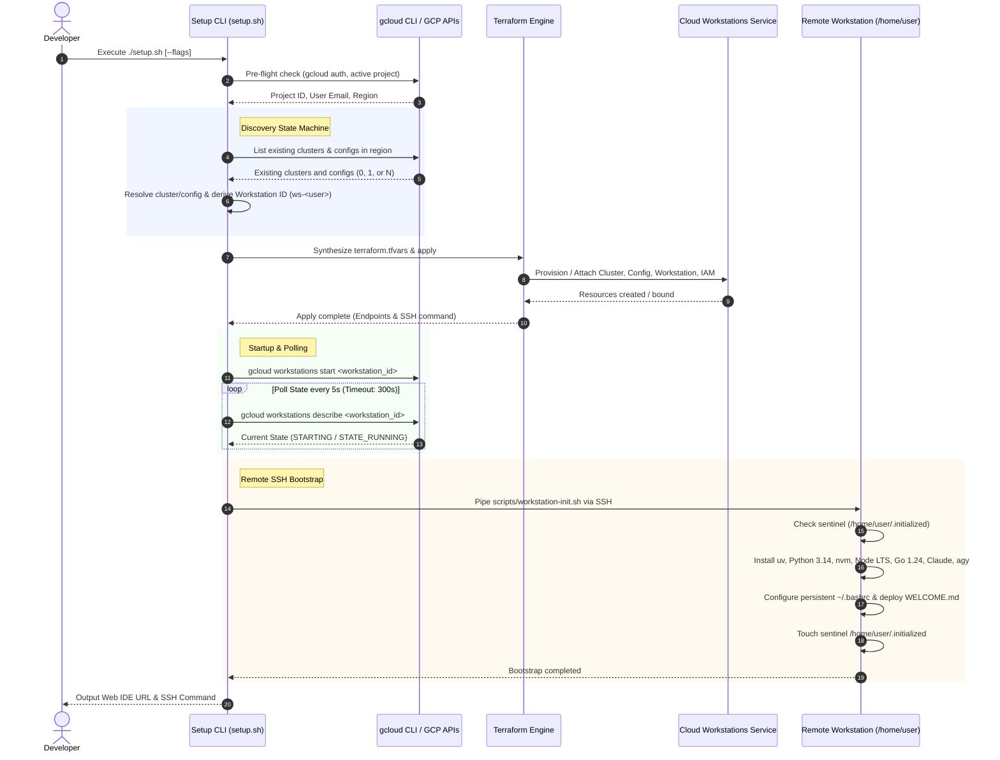

# Google Cloud Workstations AI Developer Bootstrap

[](https://cloud.google.com/workstations)
[](https://www.terraform.io/)
[](https://docs.astral.sh/uv/)
[](https://nodejs.org/)
[](https://go.dev/)
[](https://docs.anthropic.com/en/docs/agents-and-tools/claude-code/overview)
[](https://cloud.google.com/)

An automated infrastructure-as-code and user-space runtime orchestrator for [Google Cloud Workstations](https://cloud.google.com/workstations). This repository provisions and bootstraps cloud developer environments pre-configured with AI coding companions ([Claude Code](https://docs.anthropic.com/en/docs/agents-and-tools/claude-code/overview) and [Google Antigravity](https://cloud.google.com/)), modern language runtimes (Python 3.14 via `uv`, Node.js LTS via `nvm`, and Go 1.24+ SDK), and persistent user-space storage.

---

## Architecture & Lifecycle Flow

The deployment operates across two distinct tiers:

1. **Infrastructure Plane (Terraform)**: Declaratively provisions or attaches to workstation clusters, workstation configurations (`n2-standard-8`, 200 GB persistent home disk, quick-start pool 1, 2-hour idle timeout), workstation instances, and granular IAM user bindings (`roles/workstations.user`).
2. **Runtime Plane (`scripts/workstation-init.sh`)**: Once the instance enters `STATE_RUNNING`, the orchestrator tunnels via `gcloud workstations ssh` to install developer tools directly into `/home/user` (`~/.local/bin`, `~/.nvm`, `~/sdk/go`).



> [!IMPORTANT]
> **Persistent vs. Ephemeral Storage**:
> - **`/home/user` is PERSISTENT**: Mounted from a Compute Engine persistent disk (or Hyperdisk Balanced). Code, virtual environments, toolchains, and shell profiles survive stops, starts, and VM host rescheduling.
> - **`/` (Container Root) is EPHEMERAL**: Container system directories reset to the base image upon restart. Never install packages using `sudo apt-get` or store files outside `/home/user`.

---

## Quickstart & Usage

### Prerequisites
- [Google Cloud SDK (`gcloud`)](https://cloud.google.com/sdk/docs/install) (`>= 450.0.0`) authenticated via `gcloud auth login` and `gcloud auth application-default login`
- [Terraform CLI](https://developer.hashicorp.com/terraform/install) (`>= 1.5.0`)
- Required GCP APIs enabled:
  ```bash
  gcloud services enable workstations.googleapis.com compute.googleapis.com iam.googleapis.com
  ```

### 1. Interactive Setup
Run `setup.sh` to trigger the interactive discovery wizard:
```bash
./setup.sh
```
The script will:
- Validate local tools and GCP credentials.
- Discover existing workstation clusters and configurations in your region.
- Prompt to attach to existing infrastructure or provision new resources.
- Run Terraform, start the instance, and deploy the user-space toolchains over SSH.

### 2. Non-Interactive / CI/CD Deployment

**Greenfield (Create new cluster, config, and workstation):**
```bash
./setup.sh --non-interactive \
  --project="my-gcp-project" \
  --region="us-central1" \
  --email="developer@example.com" \
  --cluster="dev-cluster" \
  --config="dev-config" \
  --workstation="ws-developer"
```

**Brownfield (Attach to existing shared cluster & config):**
```bash
./setup.sh -n \
  -p "my-gcp-project" \
  -r "us-central1" \
  -e "developer@example.com" \
  -c "shared-cluster" \
  --config "shared-config"
```

**Machine Type Override:**
```bash
./setup.sh -n -p "my-gcp-project" -c "dev-cluster" --config "dev-config" -m "n4-standard-8"
```

**Dry-Run Simulation:**
```bash
./setup.sh --dry-run --non-interactive \
  --project="my-gcp-project" \
  --email="developer@example.com" \
  --cluster="test-cluster" \
  --config="test-config"
```

---

## CLI Options & Flags

`setup.sh` supports the following flags and environment variable equivalents:

| Flag | Long Flag | Description | Default / Fallback |
| :--- | :--- | :--- | :--- |
| `-r` | `--region <region>` | Target GCP region | `us-central1` (or `REGION` / `GCP_REGION`) |
| `-p` | `--project <id>` | GCP Project ID override | Active `gcloud` project (or `PROJECT_ID`) |
| `-e` | `--email <email>` | Workstation user email | Authenticated `gcloud` user (or `USER_EMAIL`) |
| `-c` | `--cluster <id>` | Target workstation cluster ID | Interactive prompt / `CLUSTER_ID` |
| | `--config <id>` | Target workstation configuration ID | Interactive prompt / `CONFIG_ID` |
| `-w` | `--workstation <id>` | Target workstation instance ID | Auto-derived `ws-<user>` / `WORKSTATION_ID` |
| `-m` | `--machine-type <type>` | Compute Engine machine type | `n2-standard-8` (or `MACHINE_TYPE`) |
| `-n`, `-y` | `--non-interactive` | Run headlessly without prompts | Interactive mode (`NON_INTERACTIVE=1`) |
| `-d` | `--dry-run` | Simulate operations without modifying GCP | `DRY_RUN=1` |
| `-h` | `--help` | Show command usage and exit | |

---

## Connecting & Day-2 Operations

### Connecting
- **Browser IDE (Code-OSS)**: Open the web URL printed at the end of setup:
  `https://<workstation>.<cluster>.<region>.workstations.cloud.google`
- **Terminal SSH**:
  ```bash
  gcloud workstations ssh <workstation_id> --cluster=<cluster_id> --config=<config_id> --region=<region>
  ```

### Toolchain Verification
Verify persistent toolchains installed under `/home/user`:
```bash
python3.14 --version    # Managed via Astral uv
uv --version
node -v && npm -v       # Node.js LTS managed via nvm
go version              # Go 1.24+ SDK
claude --version        # Claude Code CLI
agy --version           # Google Antigravity CLI
motd                    # View onboarding cheat sheet (~/WELCOME.md)
```

### AI Tool Authentication
- **Google Antigravity CLI**:
  ```bash
  agy auth login
  ```
- **Claude Code CLI**:
  - *Vertex AI Mode (Pre-configured)*: Runs using GCP IAM credentials without API keys:
    ```bash
    export CLAUDE_CODE_USE_VERTEX=1
    claude
    ```
  - *Direct Anthropic API Key*:
    ```bash
    export ANTHROPIC_API_KEY="sk-ant-api03-..."
    claude
    ```

### Common Commands & Maintenance
```bash
# Stop workstation (save compute costs when idle)
gcloud workstations stop <workstation_id> --cluster=<cluster_id> --config=<config_id> --region=<region>

# Start workstation
gcloud workstations start <workstation_id> --cluster=<cluster_id> --config=<config_id> --region=<region>

# Port forwarding to local machine (e.g. ports 3000 and 8080)
gcloud workstations ssh <workstation_id> --cluster=<cluster_id> --config=<config_id> --region=<region> \
  -- -L 3000:localhost:3000 -L 8080:localhost:8080

# Re-run runtime bootstrap inside workstation
rm -f /home/user/.initialized
bash < scripts/workstation-init.sh

# Destroy all provisioned infrastructure
terraform destroy -auto-approve
```

---

## Official Documentation & References

### Google Cloud Workstations
- [Google Cloud Workstations Overview](https://cloud.google.com/workstations/docs/overview) – Product architecture, managed container model, and enterprise capabilities.
- [Workstation Clusters Guide](https://cloud.google.com/workstations/docs/clusters) – Network topology, VPC connectivity, and regional cluster administration.
- [Workstation Configurations Guide](https://cloud.google.com/workstations/docs/configurations) – Machine types, persistent home directories, and quick-start pools.
- [Private Clusters & VPC Service Controls](https://cloud.google.com/workstations/docs/configure-vpc-service-controls) – Private endpoints, Private Service Connect (PSC), and zero-egress environments.
- [Cloud Workstations Pricing](https://cloud.google.com/workstations/pricing) – Compute, persistent storage, and management licensing costs.
- [gcloud workstations CLI Reference](https://cloud.google.com/sdk/gcloud/reference/workstations) – Command-line reference for managing workstations, clusters, and configs.
- [Cloud Workstations Base Images Repository](https://github.com/GoogleCloudPlatform/cloud-workstations-tools) – Source code for official Google Cloud Workstations container images and utilities.

### Terraform Google Provider
- [`google_workstations_workstation_cluster`](https://registry.terraform.io/providers/hashicorp/google/latest/docs/resources/workstations_workstation_cluster) – Terraform resource documentation for workstation clusters.
- [`google_workstations_workstation_config`](https://registry.terraform.io/providers/hashicorp/google/latest/docs/resources/workstations_workstation_config) – Terraform resource documentation for workstation configurations.
- [`google_workstations_workstation`](https://registry.terraform.io/providers/hashicorp/google/latest/docs/resources/workstations_workstation) – Terraform resource documentation for individual workstation instances.
- [`google_workstations_workstation_iam_member`](https://registry.terraform.io/providers/hashicorp/google/latest/docs/resources/workstations_workstation_iam_member) – Terraform resource documentation for IAM user access bindings.

### Developer Toolchains & AI Companions
- [Claude Code Overview & CLI Documentation](https://docs.anthropic.com/en/docs/agents-and-tools/claude-code/overview) – Anthropic's agentic command-line interface.
- [Claude Code with Vertex AI](https://docs.anthropic.com/en/docs/agents-and-tools/claude-code/overview#using-google-cloud-vertex-ai) – Enterprise IAM setup without third-party API keys.
- [Google Antigravity](https://cloud.google.com/) – Google's agentic developer platform and `agy` CLI.
- [Astral uv Documentation](https://docs.astral.sh/uv/) – Extremely fast Python package and project manager.
- [nvm (Node Version Manager)](https://github.com/nvm-sh/nvm) – POSIX-compliant bash script to manage multiple Node.js versions.
- [Go Programming Language Documentation](https://go.dev/doc/) – Official Go install guides, toolchains, and specifications.

### Repository Links
- [Quickstart Guide (3-Minute Setup)](QUICKSTART.md) – Step-by-step walkthrough for Google Cloud Shell or local machines.
- [Automated Test Suite (`tests/test_setup.sh`)](tests/test_setup.sh) – Regression test runner for argument parsing and workflows.
- [Workstation Bootstrap Script (`scripts/workstation-init.sh`)](scripts/workstation-init.sh) – Remote container setup script.
- [License](LICENSE) – MIT License.
